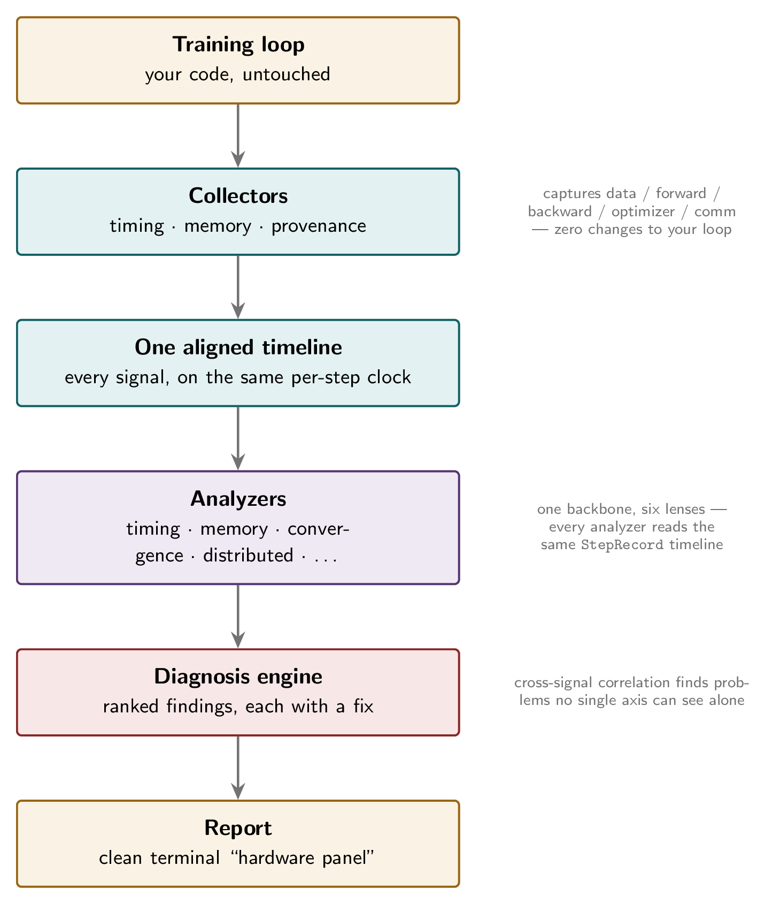

# pytscope

**See *why* your training is slow — not just that it is.**

`pytscope` watches your training loop, then tells you in plain language what's
slowing it down and how to fix it — not just a wall of numbers.

```
● TIMING — 95 steps · 23.1 ms/step · 43.3 steps/s
  data       ████████████████░░░░░░░░░░░░░░  52.0%
  forward    █████████░░░░░░░░░░░░░░░░░░░░░  17.3%
  backward   ██████████████░░░░░░░░░░░░░░░░  26.0%
  optimizer  █░░░░░░░░░░░░░░░░░░░░░░░░░░░░░   4.3%

● FINDINGS (1)
  [HIGH] Input pipeline is a bottleneck  (TIMING.DATALOADER_BOUND)
        52% of step time is spent fetching data. The accelerator is
        stalling on the dataloader.
        -> Raise DataLoader num_workers, set persistent_workers=True
           and pin_memory=True, or move heavy transforms off the hot path.
```

In a real terminal each `●` lights up red, amber, or green — a clean,
glanceable "hardware panel" view of your run.

## Install

```bash
pip install pytscope
```

Pure Python, no required dependencies. PyTorch / Lightning / Hugging Face
integrations are optional extras:

```bash
pip install "pytscope[torch,lightning,huggingface]"
```

## Quickstart

No changes to your loop (recommended):

```python
from pytscope.auto import AutoProfiler

prof = AutoProfiler("runs/exp1", model, optimizer, warmup=10)
prof.start()
for x, y in loader:                  # <- your loop, untouched
    loss = loss_fn(model(x), y)
    loss.backward()
    optimizer.step(); optimizer.zero_grad()
prof.finish()
```

Then read the report:

```bash
pytscope analyze runs/exp1
pytscope diff runs/exp1 runs/exp2     # compare two runs
```

Prefer manual control, or use Lightning / Hugging Face? See the
[usage guide](usage.md) for those paths.

## What it finds

One aligned timeline, six lenses — each backed by a real, tested analyzer:

| Lens | What it catches |
|------|-----------------|
| **Timing** | Dataloader stalls, slow backward/optimizer, step-time jitter |
| **Memory** | Peak usage, fragmentation, leaks |
| **Convergence** | Loss/grad-norm divergence, spikes |
| **Cross-signal** | Problems that only show up when several signals spike *together* |
| **Distributed** | Stragglers, load imbalance, pipeline bubbles, exposed communication |
| **Efficiency budget** | Where every second of wall time goes, anchored to MFU |

## How it works

<figure markdown>
{ width="520" }
<figcaption>Figure source: <a href="https://github.com/Sumu004/pytscope/blob/main/docs/figures/architecture.tex">architecture.tex</a> (TikZ)</figcaption>
</figure>

Pure-stdlib core, ~3 µs/step overhead — small enough to leave on by default.
Adding a new diagnosis rule is one decorated function.

## Status

Validated on real multi-GPU NCCL hardware (2× T4): straggler detection and
exposed-communication analysis both confirmed on real runs — see the
[full report](https://github.com/Sumu004/pytscope/blob/main/docs/validation-runs/2026-06-08-kaggle-2xT4/RESULTS.md)
and the [validation matrix](VALIDATION.md). DDP is first-class today;
FSDP / tensor parallelism are on the roadmap.

## Where to next

- **[Usage guide](usage.md)** — install, instrument a loop, the
  Lightning/Hugging Face callbacks, and the `analyze` / `diff` CLI
- **[Architecture](architecture.md)** — the one-timeline design, why it
  matters, and how the pieces fit together
- **[Diagnostics reference](diagnostics.md)** — every finding code, what
  triggers it, and what to do about it
- **[Validation](VALIDATION.md)** — what's proven, and how to reproduce it
- **[Changelog](changelog.md)** — what's new in each release

## Contributing

Contributions are welcome — adding a diagnosis rule is the easiest first PR.
See [CONTRIBUTING](https://github.com/Sumu004/pytscope/blob/main/CONTRIBUTING.md)
and the [Code of Conduct](https://github.com/Sumu004/pytscope/blob/main/CODE_OF_CONDUCT.md).

## License

[MIT](https://github.com/Sumu004/pytscope/blob/main/LICENSE) © 2026 Sumukh Chaluvaraju
